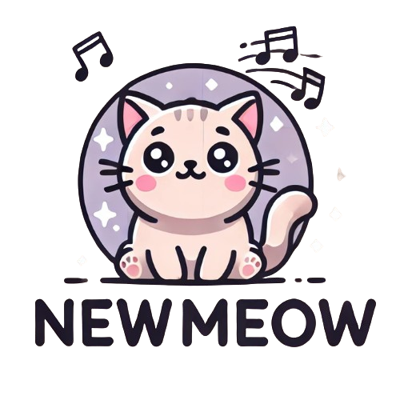

# ASP.NET Web Framework Project - PSD Qualification

<p align="center">
  <a href="">
    
  </a>
</p>

<p align="center">
  ASP.NET Web Framework Project
  <br>
  A modern web framework built using ASP.NET Core, designed for robust and scalable web applications.
</p>

<!-- START doctoc generated TOC please keep comment here to allow auto update -->
<!-- DON'T EDIT THIS SECTION, INSTEAD RE-RUN doctoc TO UPDATE -->
## Table of Contents

- [Project Overview](#project-overview)
- [Prerequisites](#prerequisites)
- [How to Run the Project Locally](#how-to-run-the-project-locally)
- [Project Structure](#project-structure)
- [Owner](#Owner)
- [Contact](#contact)

<!-- END doctoc generated TOC please keep comment here to allow auto update -->

## **Project Overview**

Welcome to the **ASP.NET Web Framework Project**! This project is just a simple FullStack ASP.NET to CRUD with transactions. There are 2 roles, admin and user.

### **Core Features**
- **Domain Driven Design:** Using DDD Software Architecture (Model, Factory, Handler, Repository, Controller, and WebService).
- **Database Integration:** Using ASP.NET Database & LINQ
- **Middleware:** Middleware to access Home Page and Conditional Rendering between Admin and User.
- **Handling Transaction:** Using Crystal Report to handle user's transaction

### **Technology Stack**
- **Web Framework:** ASP.NET Core (version 6.0 or newer)
- **Programming Language:** C#
- **Database:** ASP.NET Database
- **Authentication:** Cookie Authentication
- **Frontend (Optional):** HTML

## **Prerequisites**

Before running this project, make sure you have the following installed:

1. **Visual Studio 2022:**
   - Download and install Visual Studio 2022 from [here](https://visualstudio.microsoft.com/).
   - Ensure you have the **ASP.NET and web development** workload selected during installation.

2. **.NET SDK:**
   - Install the .NET SDK (version 6.0 or newer) from [here](https://dotnet.microsoft.com/download).

3. **Git (optional):**
   - Git is required to clone the repository. Download Git from [here](https://git-scm.com/).
   - Verify Git installation by running the following command:

     ```bash
     git --version
     ```

## **How to Run the Project Locally**

Follow the steps below to set up and run the project locally:

1. **Clone the Repository:**
   - Open a terminal and clone the repository to your local machine:

     ```bash
     git clone https://github.com/StyNW7/PatternSoftwareDesign-Qualification.git
     ```

2. **Navigate to the Project Folder:**
   - Go to the project directory:

     ```bash
     cd PatternSoftwareDesign-Qualification
     ```

3. **Open the Project in Visual Studio:**
   - Open **Visual Studio 2022** and select **File > Open > Project/Solution**.
   - Choose the solution file (`.sln`) from the project folder.

4. **Restore Dependencies:**
   - Visual Studio will automatically restore the necessary NuGet packages. If not, go to **Tools > NuGet Package Manager > Package Manager Console** and run:

     ```bash
     dotnet restore
     ```

5. **Run the Project:**
   - Press **F5** or click **Run** in Visual Studio to start the application locally.
   - The application should now be accessible via `http://localhost:5000` or the URL configured in your settings.

## **Project Structure**

The project is organized into 2 main folders:

- **PSD_Qualification_Frontend:** This is a frontend folder that contains views, frontend controller, layout, modules, and transaction handler using Crystal Report and the dataset.
- **PSD_Qualification:** This is a backend folder that contains the data models used by the application. Besides that, its also contains factories, handlers, modules, repositories, and web services.

## **Owner**
This project was created for SLC Pattern Software Design Post Training Qualification

- **Stanley Nathanael Wijaya as NW25-1**

---

## Contact
Have questions or want to collaborate?

- 📧 Email: stanley.n.wijaya7@gmail.com
- 💬 Discord: `stynw7`

<code>NewmeoW: Where there is a cat, there is cute love 🐈😽</code>
